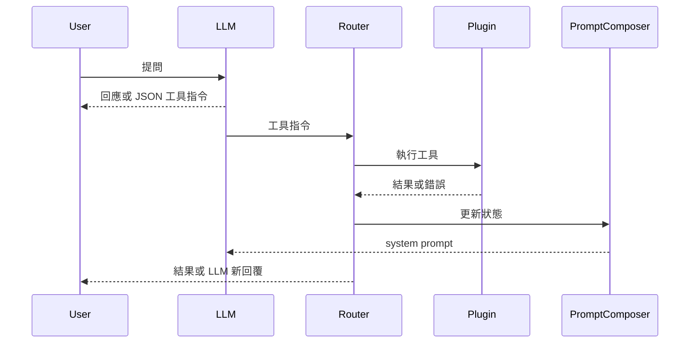

# toolOutputRouter 與 PromptComposer 流程

```mermaid
sequenceDiagram
    participant User
    participant LLM
    participant Router
    participant Plugin
    User->>LLM: 提問
    LLM-->>User: 回應或 JSON 工具指令
    LLM->>Router: 工具指令
    Router->>Plugin: 執行工具
    Plugin-->>Router: 結果或錯誤
    Router->>PromptComposer: 更新狀態
    PromptComposer-->>LLM: system prompt
    Router-->>User: 結果或 LLM 新回覆
```
